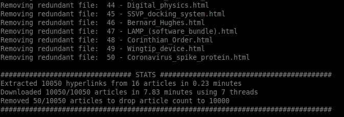
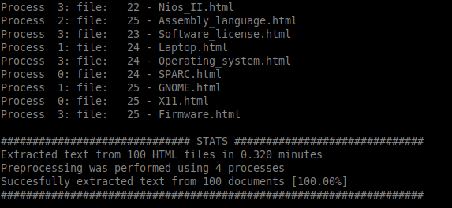

# ir-course-uoi-data

The project for the Information Retrieval course @[cse.uoi.gr](http://cse.uoi.gr)
is about implementing a search engine for [Wikipedia](https://www.wikipedia.org/)
articles using [Apache Lucene](https://lucene.apache.org/).

Article crawling is performed using `crawl-wikipedia.py` and is organized
in two stages.
 * In stage one, the crawler reads `crawler-seeds.txt` and retrieves the
 corresponding webpages which are parsed to identify more URLs to Wikipedia
 articles, continuing recursively until the required amount of URLs has been
 reached.
 * In stage two, Wikipedia articles specified by the URls retrieved in stage
 one are downloaded by multiple threads to achieve a small download time 
 (by utilizing larger bandwidth). The raw HTML files are stored in `repository/`
 directory.
 
 Plain text extraction from HTML files is performed by `preprocess.py` and output
 text files are stored in `corpus/` directory. Because `repository/` and `corpus/`
 exceed 1 GB of storage size, `corpus/` directory has not been uploaded in git.
 In [ir-course-uoi](https://github.com/gzachos/ir-course-uoi), the implementation
 of the search engine has taken place.

# Screenshots

 
 # License
[GNU GENERAL PUBLIC LICENSE Version 2, June 1991](LICENSE)

